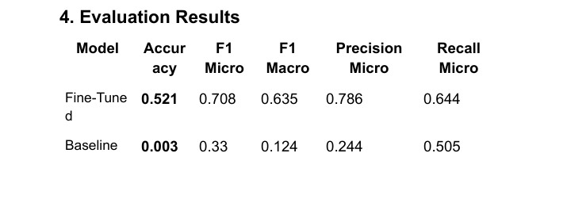

# ECHR Multi-Label Case Classifier

## Overview
**LexLabeler** is a project designed to **predict which articles of the European Convention on Human Rights (ECHR) are involved in a legal case** based on its factual description.  
It implements a **multi-label classification system** using **LegalBERT**, a domain-specific language model pretrained on legal texts.

This tool can assist law firms, researchers, and legal analysts in **automatic tagging of legal documents** for human rights analysis.

---

## Dataset
- **Source:** [LexGLUE – ECTHR-B](https://huggingface.co/datasets/coastalcph/lex_glue)  
- **Description:** Approximately 11,000 legal case facts with associated ECHR articles.  
- **Features:**
  - `text` → factual description of the case
  - `labels` → multi-hot encoded vector indicating the violated ECHR articles
- **Task:** Multi-label classification (one case may correspond to multiple articles)

 ##  Evaluation Results

The table below shows the performance of different models on the ECtHR-B test set:

---

## Approach
1. **Data Preprocessing**
   - Text cleaning (lowercasing, removing special characters)
   - Tokenization using LegalBERT tokenizer
   - Label encoding as **multi-hot vectors**
   - Train-validation-test split

2. **Model**
   - Base: **LegalBERT (`nlpaueb/legal-bert-base-uncased`)**
   - Classifier head: Linear layer on top of `[CLS]` embedding
   - Multi-label output with **sigmoid activation**
   - Loss function: **BCEWithLogitsLoss**

3. **Training**
   - Learning rate: 2e-5
   - Batch size: 8–16
   - Epochs: 3–5
   - Metrics: Micro-F1, Macro-F1, Hamming Loss

4. **Evaluation**
   - Predictions compared against ground truth using multi-label metrics and increased accuracy

---

### **Key Insights**
- **Significant Improvement:** Fine-tuning LegalBERT greatly improves all key metrics over the baseline, showing the importance of domain-specific adaptation.  
- **High Precision:** Micro-Precision of 0.786 ensures most predicted articles are correct, minimizing false positives.  
- **Strong Recall:** Micro-Recall of 0.644 shows the model effectively identifies relevant articles per case.  
- **Balanced Performance:** Micro-F1 (0.708) and Macro-F1 (0.635) demonstrate the model’s ability to handle both frequent and rare articles.  
- **Baseline Limitations:** The baseline fails to capture multi-label patterns, highlighting the necessity of fine-tuning.

**Conclusion:**  
LexLabeler proves that **fine-tuning a domain-specific language model on legal texts** substantially enhances multi-label classification, making it a **practical tool for legal document analysis and human rights case annotation**.

---

